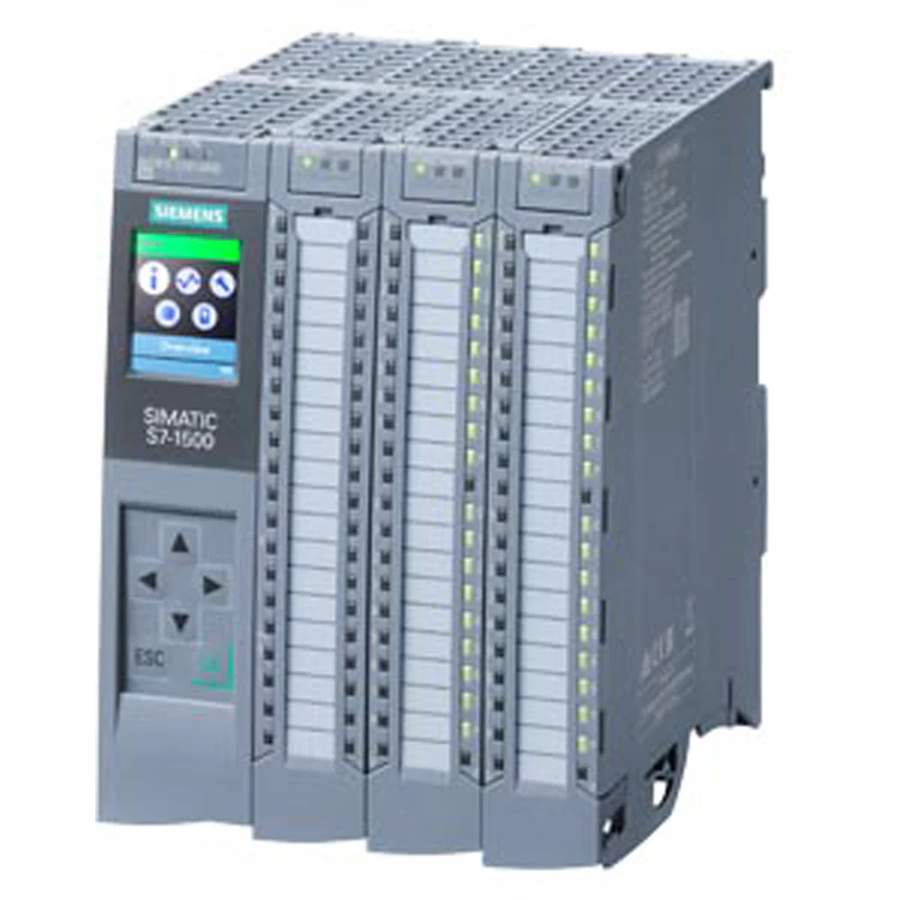

MATERIAL
<html lang="es">
<head>
  <meta charset="UTF-8">
  <title>Mi página</title>

  
</head>

<body>

  

    
    <h2> PLC 400 CON PERIFERIA </h2>
  

 

    
    <h3> PLC 1500 </h3>
  

</body>
</html>
